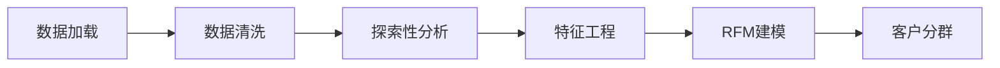

# OnlineRetail-Analysis

# 电商用户行为分析与RFM建模

## 项目概述
分析在线零售数据集（2010-2011），通过RFM模型识别高价值客户群体，为精准营销提供数据支持。

**数据集**：[Online Retail Dataset](https://www.kaggle.com/vijayuv/onlineretail)  
**数据规模**：541,909 条交易记录

## 分析流程

## 关键发现
发现维度	   关键数据	                                                    业务意义
高价值客户	 12.8%客户贡献核心收入（频率13.5x，金额7,703.75）	              优先资源投入，制定保留策略
普通客户	   46.8%占比，价值中等（金额1,751.74）	                          优化营销提升ARPU
流失风险	   29.5%客户流失（重要流失客单价1,634.69）	                      启动挽回计划，减少收入损失
潜力群体	   新客户（5.4%）+忠实低价值客户（5.5%）                         	设计培育路径，挖掘增量价值
聚类有效性	 Cluster 2（30.5%客户）驱动54%更高收入（金额5,494.3 vs 均值615）	验证RFM分群，支持精准运营

## 可视化展示

*图：基于K-Means聚类的客户价值分群*

## 技术栈
- **数据处理**：Pandas, NumPy
- **可视化**：Matplotlib, Seaborn, Plotly
- **机器学习**：Scikit-learn

